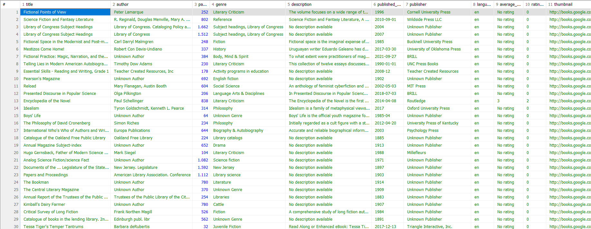

# BASE DE DATOS - **LIBROS** 📚

## Descripción
El presente proyecto tiene como objetivo aprender sobre el proceso de normalización de datos a partir de un archivo de formato .csv, con el propósito de comprender y aplicar buenas prácticas de diseño y organización de bases de datos relacionales.

Utilizando la web kaggle, seleccioné un dataset que contiene una colección de más de 2000 libros e  incluye información relevante sobre los mismos, como autores, fechas de publicación, géneros, idiomas y, además, un análisis de métricas relacionadas a las calificaciones otorgadas por los lectores. Estos datos fueron recopilados de la plataforma Google Books.

El proceso desarrollado consistió en la descarga del archivo y su posterior importación a un motor de base de datos (MySQL), esto permitió gestionar, analizar y modificar los registros de acuerdo a necesidades y objetivos definidos.

Para visualizar la colección de datos: [Books Dataset](https://www.kaggle.com/datasets/madankhatri123h/books-dataset)


## Instalación

1. Descargá el script .sql o, utilizando el comando `git clone`, cloná y guardá el siguiente repositorio:

    ```
    https://github.com/LuanaEsquivel/Books.git
    ```

2. Importá el archivo .sql o script en el motor de base de datos.


## Proceso de Normalización

1. Como primera instancia, elegí un dataset cuya estructura permitiera crear, como mínimo, 6 tablas en la base de datos.

2. Descargué el archivo .csv y slo importé al programa Excel para poder visualizar que los datos esten correctamente organizados y los separadores de columnas y de líneas.




3. Visualizando los datos, diseñé la estructura de la base de datos, tablas y conexiones.

4. Para la creación de la base de datos, utilicé el comando:

    ```sql
    CREATE DATABASE libros;
    ```

5. Creé una tabla temporal, llamada "**csv_temp**", para importar el archivo .csv, la utilicé como tabla madre para luego insertar los datos en las tablas definitivas.

    ```sql
    CREATE TABLE csv_temp (
        title VARCHAR(250) NOT NULL, 
        author VARCHAR(250) NOT NULL, 
        pages INT NULL, genre VARCHAR(250) NULL, 
        `description` VARCHAR(250) NULL, 
        published_date VARCHAR(250) NULL, 
        publisher VARCHAR(250) NULL, 
        `language` VARCHAR(250) NULL,
        average_rating VARCHAR(250) NULL, 
        ratings_count VARCHAR(250) NULL, 
        thumbnail VARCHAR(250) NULL
    );
    ```


6. Luego, importé el archivo .csv.

    ```sql
    LOAD DATA INFILE 'C:/Users/Luana/Downloads/Libros/Books.csv'
    INTO TABLE csv_temp 
    FIELDS TERMINATED BY ',' 
    optionally ENCLOSED BY '"' 
    LINES TERMINATED BY '\n' 
    IGNORE 1 LINES;
    ```

7. Con todos los datos cargados, procedí a crear todas las tablas definitivas, definiendo claves primarias y foráneas, tipos de datos (INT y VARCHAR para facilitar el traspaso de los datos) y las asociaciones.

    * Tabla **EDITORIALES**:
    
        ```sql
        CREATE TABLE editoriales (
            edi_id INT AUTO_INCREMENT NOT NULL PRIMARY key,
            edi_nomb VARCHAR(250) NOT NULL
        );
        ```

    * Tabla **IDIOMAS**:
    
        ```sql
        CREATE TABLE idiomas (
            idi_id INT AUTO_INCREMENT NOT NULL PRIMARY key,
            idi_desc VARCHAR(250) NOT NULL
        );
        ```

    * Tabla **AUTORES**:
    
        ```sql
        CREATE TABLE autores (
            aut_id INT AUTO_INCREMENT NOT NULL PRIMARY key,
            aut_nomb VARCHAR(250) NOT NULL
        );
        ```

    * Tabla **LIBROS**:
    
        ```sql
        CREATE TABLE libros (
            lib_id INT AUTO_INCREMENT NOT NULL PRIMARY key, 
            lib_titu VARCHAR(250) NOT NULL, 
            lib_desc VARCHAR(1000) NULL, 
            lib_pagi INT NOT NULL, 
            lib_fech VARCHAR(250) NULL, 
            lib_port VARCHAR(250) NULL, 
            idi_id INT NOT NULL, 
            edi_id INT NOT NULL, 
            FOREIGN KEY (idi_id) REFERENCES idiomas(idi_id),
            FOREIGN KEY (edi_id) REFERENCES editoriales(edi_id)
        );
        ```

    * Tabla intermedia **LIBRO_AUTOR**:
    
        ```sql
        CREATE TABLE libro_autor (
            lib_id INT NOT NULL, 
            aut_id INT NOT NULL, 
            PRIMARY KEY (lib_id, aut_id), 
            FOREIGN KEY (lib_id) REFERENCES libros(lib_id), 
            FOREIGN KEY (aut_id) REFERENCES autores(aut_id)
        );
        ```

    * Tabla **GÉNEROS**:
    
        ```sql
        CREATE TABLE generos (
            gen_id INT AUTO_INCREMENT NOT NULL PRIMARY key, 
            gen_desc VARCHAR(250) NOT NULL
        );
        ```

    * Tabla intermedia **LIBRO_GÉNERO**:
    
        ```sql
        CREATE TABLE libro_genero (
            lib_id INT NOT NULL, 
            gen_id INT NOT NULL, 
            PRIMARY KEY (lib_id, gen_id), 
            FOREIGN KEY (lib_id) REFERENCES libros(lib_id), 
            FOREIGN KEY (gen_id) REFERENCES generos(gen_id)
        );
        ```

    * Tabla **MÉTRICAS**:
    
        ```sql
        CREATE TABLE metricas (
            lib_id INT NOT NULL PRIMARY key, 
            met_cantcal int NULL, 
            met_cali VARCHAR(250) NOT NULL, 
            FOREIGN KEY (lib_id) REFERENCES libros(lib_id)
        );
        ```

8. Trasladé los datos de la tabla temporal a las definitivas. 

    * Para las tablas **editoriales** e **idiomas** se utilizó el siguiente comando, reemplazando el nombre de las tablas y los atributos:

        ```sql
        INSERT INTO tabla_destino (atributos) 
        SELECT DISTINCT atributo_origen 
        FROM tabla_origen;
        ```

9. Debido a que en las tablas de **autores** y **géneros** algunos campos poseían más de un valor único, ejecuté un script para cada tabla en Python. Este script los separó para que cada valor único obtenga su respectivo ID, y luego, guardó un archivo .csv solo con los datos de estas dos tablas. 

    * Tabla **AUTORES**:
        ```py  
        import pandas as pd

        df = pd.read_csv('C:/Users/Luana/Downloads/Libros/Books.csv')
        author_set = set()

        for auth_str in df['author'].dropna():
            for a in auth_str.split(','):
                author_set.add(a.strip())

        author_df = pd.DataFrame({'name': list(author_set)})
        author_df.to_csv('C:/Users/Luana/Downloads/author.csv', index=False)
        ```

    * Tabla **GÉNEROS**:
        ```py
        import pandas as pd

        df = pd.read_csv('C:/Users/Luana/Downloads/Libros/Books.csv')
        genre_set = set()

        for genre_str in df['genre'].dropna():
            for g in genre_str.split(','):
                genre_set.add(g.strip())

        genre_df = pd.DataFrame({'name': list(genre_set)})
        genre_df.to_csv('C:/Users/Luana/Downloads/genre.csv', index=False)
        ```

10. Para importar estos archivos .csv a las tablas correspondientes, utilicé los comandos:

    * Archivo de **AUTORES**:
        ```sql
        LOAD DATA INFILE 'C:/Users/Luana/Downloads/author.csv' 
        INTO TABLE autores 
        FIELDS TERMINATED BY ',' 
        LINES TERMINATED BY '\r\n' 
        IGNORE 2 LINES (aut_nomb);
        ```

    * Archivo de **GÉNEROS**:
        ```sql
        LOAD DATA INFILE 'C:/Users/Luana/Downloads/genre.csv' 
        INTO TABLE generos 
        FIELDS TERMINATED BY ',' 
        LINES TERMINATED BY '\r\n' 
        IGNORE 1 LINES (gen_desc);
        ```

11. Trasladé los datos desde la tabla madre a las tablas definitivas que faltaban: **libros**, **métricas** y las tablas intermedias de **libro_autor** y **libro_género**.

    * Tabla **LIBROS**:
        ```sql
        INSERT INTO libros (lib_titu, lib_desc, lib_pagi, lib_fech, lib_port, idi_id, edi_id)
        SELECT 
            c.title,
            c.`description`,
            c.pages,
            c.published_date,
            c.thumbnail,
            i.idi_id,
            e.edi_id
        FROM csv_temp c
        JOIN idiomas i ON c.`language` = i.idi_desc
        JOIN editoriales e ON c.publisher = e.edi_nomb;
        ```

    * Tabla **MÉTRICAS**:
        ```sql
        INSERT INTO metricas (lib_id, met_cantcal, met_cali)
        SELECT
            l.lib_id,
            c.ratings_count,
            c.average_rating
        FROM libros l
        JOIN csv_temp c
            ON l.lib_titu = c.title
            AND l.lib_pagi = c.pages
        GROUP BY l.lib_id;
        ```

    * Tabla **LIBRO_AUTOR**:
        ```sql
        INSERT INTO libro_autor (lib_id, aut_id)
        SELECT
            l.lib_id,
            a.aut_id
        FROM libros l
        JOIN csv_temp c
            ON l.lib_titu = c.title
        join autores a 
            ON c.author = a.aut_nomb
        GROUP BY l.lib_id;
        ```

    * Tabla **LIBRO_GÉNERO**:
        ```sql
        INSERT INTO libro_genero (lib_id, gen_id)
        SELECT
            l.lib_id,
            g.gen_id
        FROM libros l
        JOIN csv_temp c
            ON l.lib_titu = c.title
        join generos g 
            ON c.genre = g.gen_desc
        GROUP BY l.lib_id;
        ```

12. Por último, eliminé la tabla temporal **csv_temp**:

    ```sql
    DROP TABLE csv_temp;
    ```


## Diagrama ER
Al finalizar la creación de la base de datos con toda su estructura de tablas, relaciones y datos, utilicé el programa "dbdiagram.io" para graficar el Diagrama Entidad - Relación.


## Consultas
Distintas consultas que realicé una vez finalizada la base de datos, para verificar su correcto funcionamiento (tablas, asociaciones y datos).

* Cantidad de libros por cada género:

    ```sql
    SELECT gen_desc AS Género, COUNT(*) AS Cantidad_libros 
    FROM libro_genero lg
    INNER JOIN generos g ON lg.gen_id = g.gen_id
    GROUP BY gen_desc;
    ```

* Mostrar el título(A-Z), autor, género, idioma, editorial, número de páginas y fecha de todos los libros:

    ```sql
    SELECT lib_titu AS Título, aut_nomb AS Autor, gen_desc AS Género, idi_desc AS Idioma, edi_nomb AS Editorial, lib_pagi AS Páginas, lib_fech AS Fecha
    FROM libros l
    INNER JOIN idiomas i ON l.idi_id = i.idi_id
    INNER JOIN editoriales e ON l.edi_id = e.edi_id
    LEFT JOIN libro_genero lg ON l.lib_id = lg.lib_id
    LEFT JOIN generos g ON lg.gen_id = g.gen_id
    LEFT JOIN libro_autor la ON l.lib_id = la.lib_id
    LEFT JOIN autores a ON la.aut_id = a.aut_id
    ORDER BY l.lib_titu ASC;
    ```

* Libros en inglés, que poseen 500 o más páginas, ordenados por fecha de lanzamiento:

    ```sql
    SELECT lib_titu AS Título, idi_desc AS Idioma, lib_pagi AS Páginas, lib_fech AS Fecha_Lanzamiento
    FROM libros l
    INNER JOIN idiomas i ON l.idi_id = i.idi_id
    WHERE l.lib_pagi >= 500 AND i.idi_desc = "en"
    ORDER BY l.lib_fech ASC;
    ```

* Las 5 editoriales con mayor cantidad de libros publicados:

    ```sql
    SELECT edi_nomb AS Editorial, COUNT(lib_id) AS lib_publi
    FROM editoriales e
    INNER JOIN libros l ON e.edi_id = l.edi_id
    WHERE e.edi_nomb <> "Unknown Publisher" 
    GROUP BY e.edi_id
    ORDER BY lib_publi DESC
    LIMIT 5;
    ```

* Géneros mejor calificados:

    ```sql
    SELECT gen_desc AS Género, ROUND(AVG(m.met_cali),0) AS prom_cali
    FROM generos g
    INNER JOIN libro_genero lg ON g.gen_id = lg.gen_id
    INNER JOIN libros l ON lg.lib_id = l.lib_id
    INNER JOIN metricas m ON l.lib_id = m.lib_id 
    GROUP BY g.gen_id
    ORDER BY prom_cali DESC
    LIMIT 10;
    ```


## Creadora
El presente proyecto fue realizado por Esquivel Luana. Estudiante de la Tecnicatura Superior en Desarrollo de Software, Escuela Superior de Comercio N° 43, en la ciudad de Reconquista, Santa Fe.


